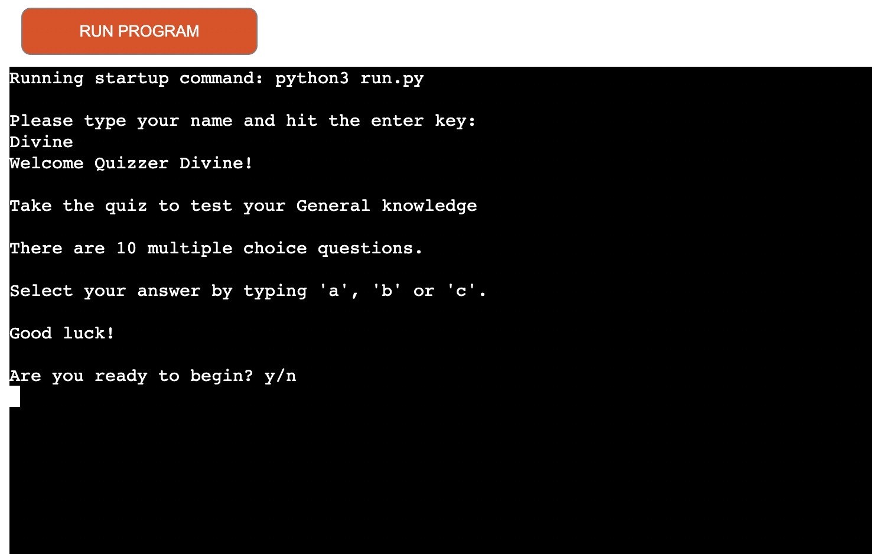

**QUIZZER**

**DECRIPTION**
This project is a command line application built with Python. The quiz has 10 general knowledge multiple choice questions which makes it easy for users to choose from. The quiz lets the users know when they have chosen the correct answer and will also let the user know when they've got the answer wrong. The users score is returned to them at the end of the quiz, and given the option to play again if they wish.

Check out the live site [here](https://quizapp-python.herokuapp.com/)

**PROEJECT GOALS**
  * Provide the user with a fun, easy to play multiple choice quiz.
  * Provide the user with points for every question the answer.
  * Provide an appropriate response to all user inputs and ensure any invalid data is handled appropriately.
  * Provide the user with their name displayed at the end of the game saying they've done a great job.

**USER EXPERIENCE**
  *  As a user I want to have clear instruction of how to play the game.
  *  As a user I want the questions to be clear.
  *  As a user I want to be able to play again if I've inputed the wrong data.
  *  As a user I want to know if I've selected the correct answer.
  *  As a user I want to know how many points scored at the end of the game.
  *  As a user I want to repeat the quiz if I want to play again.
  
**FEATURES**
   *  Introduction

    Before the user starts the game, they need to click on the Run Program button and they'll be asked to enter their username. Once the user enters their name, they are shown instructions of how to play the quiz. If the user doesn't provide a name, the user will be aksed to input their name inorder for them to play.

    
  *  Instructions
  
    The user is presented with a short description and simple instructions for the quiz. The user is asked to type 'y' for yes and 'n' for no. If the user types 'n' the user will be aksed to type 'y' when they are ready. All input will be accepted in lower case or upper case. For instance if the user inputs 'a' or "A' the input will be accepted.

   

  * Input validation and error checking
    
    As the game only requires users to choose between 'a', 'b', or 'c'. However if the user inputs any other letter the user will be asked to only input a,b or c. The user is then asked to input the given letters and is asked the same questiin again.

    

  * Questions

    The quiz contains 10 multiple questions. These questions are just general knowledge based questions which I thought to be interesting. The questions are just random questions about different topics ie, movies, the human body, celebrities etc.

    
    
    I put the questions on shuffle to make it a bit more interesting, instead of users knowing that the questions will be asked in a certain order. When the user selects the correct answer they are informed that the answer is correct. this will be colored in green. For every correct question the user answers they get a point, if they get the answer wrong they get 0 points.

  

    If the user inputs the wrong the answer, they are also informed that they got the answer wrong and this will ne colored in red.

   * Final Score

    Once all 10 questions have been answered, the user is then presented with their final score. Different messages are displayed, depending on whether the score is equal to or less than 5, or greater than 5. The message is personalised with the users name.

 

    Another message is dsplayed when the users gets less than 5.

    Afte the final score is displayed, the user is asked if they want to play again by typing 'y' or 'n'. If 'y' is typed the game starts again. If 'n' is typed, a message informs the user that the quiz has ended and to click the 'Run Program' button if they wish to reset the quiz.   

**FEATURES LEFT TO IMPLEMENT**

    In the future I would like to add more general knowledge questions. I would also like users to play against eachother or at least see how much points other users had scored.

**TESTING**
    Testing was also conducted on several devices (iphone 11, iphone XR, iphone 7plus, One plus 7t, tablet, Samsung galaxy s7, Macbook air) also on other web browsers (Safari, Chrome).

    Tested in my local terminal and Code Institute Heroku terminal.

    The game gives an input of invalid data if the player inputs invalid data.

**SOLVED BUGS**
    When I checked my code using PEP8 i had some indetation errors and whitespace erros which have been corrected.

**Remaining Bugs**

    I noticed that the app wasn't working on Iphone's. Apparently the template I used may not support Safari browser, but even when i tried to install Chrome on an Iphone the app was not responsive. The app is able to open in Safari but users can't input data.

**VALIDATOR TESTING**
    
    PEP8 No errors were returned from PEP8online.com
    

**DEPLOYMENT**

    This application has been deployed using Heroku

    1. Create or sign into a Heroku account
    2. Click the Create new app button
    3. Choose a name for the app (This needs to be unique)
    4. Choose region, then click create app.
    5. Click on settings
    6. Click reveal config vars button
    7. In this project we needed to add a key of PORT and VALUE of 8000
    8. Click add.
    9. Click add buildpack
    10. Here we add python, save changes node.js, save changes, make sure python is on top.
    11. Go to the deploy tab
    12. Choose your deployment method (ours is github)
    13. Search for our repository name, then connect
    14. You can choose to have automatic deploy on
    15. You then click on the manual deploy and wait until you see a finished message saying view app
    16. Click the view app button
    17. Click the run program button at the top.

**CREDITS**

   * Most of my Quiz questions were taken from [Buzz Feed](https://www.buzzfeed.com/uk/quizzes).

   * I watched a couple of videos on youtube and also googled python quiz game for guidance on how to sturcture my code.

   * The Geeks for Geeks article [Print Colors to Python](https://www.geeksforgeeks.org/print-colors-python-terminal/).

   * Code Institute for the deployment terminal. Love sandwiches walkthrough project for guidance.

   * I would like to thank Tutor support for the assistance, for helping me everytime I had issues creating this App. A big thank you to my mentor Chris Quinn for the support.

