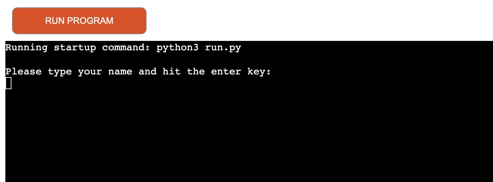

**QUIZZER**

**DECRIPTION**
This project is a command line application built with Python. The quiz has 10 general knowledge multiple choice questions which makes it easy for users to choose from. The quiz lets the users know when they have chosen the correct answer and will also let the user know when they've got the answer wrong. The users score is returned to them at the end of the quiz, and given the option to play again if they wish.

Check out the live site [here](https://quizapp-python.herokuapp.com/)

**FEATURES**

    *Introduction

    Before the user starts the game, their asked to input their username.

    

    *Instructions*

    *Input validation and error checking

    *Questions

    *Final Score

**TESTING**

    *Tested in my local terminal and Code Institute Heroku terminal.
    *The game gives an input of invalid data if the player inputs invalid data.

    
    *Remaining Bugs
    I noticed that the app wasn't working on Iphone's. Apparently the template I used may not support Safari browser, but even when i tried to install Chrome on an Iphone the app was not responsive. The app is able to open in Safari but users can't input data.

**VALIDATOR TESTING**
    
    * PEP8 No errors were returned from PEP8online.com
    

**DEPLOYMENT**

    This application has been deployed using Heroku
    Create or sign into a Heroku account
    Click the Create new app button
    Choose a name for the app (This needs to be unique)
    Choose region, then click create app.
    Click on settings
    Click reveal config vars button
    In this project we needed to add a key of PORT and VALUE of 8000
    Click add.
    Click add buildpack
    Here we add python, save changes
    node.js, save changes
    make sure python is on top.
    Go to the deploy tab
    Choose your deployment method (ours is github)
    Search for our repository name, then connect
    You can choose to have automatic deploy on
    You then click on the manual deploy and wait until you see a finished message saying view app
    Click the view app button
    Click the run program button at the top.

**CREDITS**

    *Most of my Quiz questions were taken from [Buzz Feed](https://www.buzzfeed.com/sarahaspler/general-knowledge-10-questions-quiz) and just some knowledge that I know.

    *Code Institute for the deployment terminal.

    *I would like to thank Tutor support for the assistance and also my Mentor Chris Quinn.

